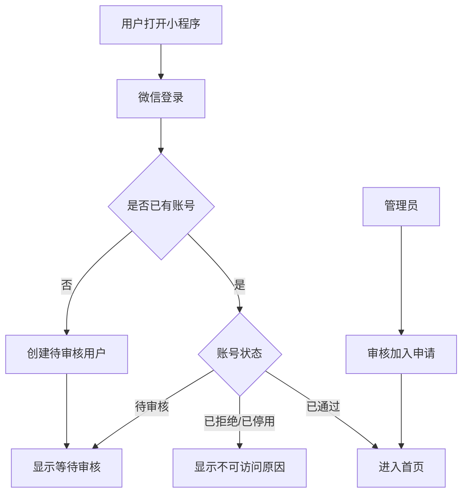
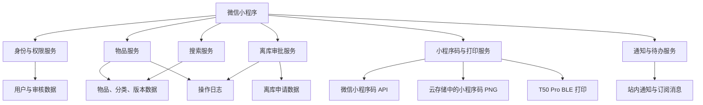

# 共享物品管理微信小程序：产品需求与架构

## 1. 文档信息

| 项目 | 内容 |
|---|---|
| 产品形态 | 微信小程序 |
| 服务范围 | 单一组织内部使用 |
| 核心能力 | 身份审核、物品登记、微信小程序码查询、T50 Pro 标签打印、文字搜索、协同编辑、离库审批、操作日志 |
| 当前阶段 | MVP 需求与技术架构 |

## 2. 产品概述

本产品用于一个组织内部的共享物品管理。组织成员通过微信登录，审核通过后可以登记、查询和编辑物品；普通成员不能直接删除物品，但可以提交离库申请；管理员可以审批离库申请或直接执行离库。

每件物品使用服务端生成的唯一微信小程序码作为实体标签。用户通过微信“扫一扫”扫描标签后，可直接打开小程序中的物品详情页；系统完成登录与身份校验后展示最新物品信息。

系统需要解决以下问题：

1. 组织成员身份需要经过审核，非组织成员不能查看或修改数据。
2. 物品信息需要统一登记，并支持图片、数量和分类。
3. 多名成员可以共同维护物品信息。
4. 并发编辑时不能静默覆盖其他成员已经提交的内容。
5. 所有关键操作需要记录操作人、时间和提交梗概。
6. 物品离库需要管理员权限或管理员审批。

## 3. 产品目标

### 3.1 核心目标

- 通过微信身份建立组织成员账号。
- 由管理员审核新成员的加入申请。
- 支持物品登记、扫码查询和文字搜索。
- 支持普通成员协同编辑物品。
- 使用版本控制处理多人同时编辑产生的冲突。
- 使用类似 Git 提交的梗概描述每次修改目的。
- 通过申请和审批流程控制物品离库。
- 使用操作日志保留物品的操作轨迹。

### 3.2 MVP 成功标准

- 未审核用户无法访问组织物品。
- 审核通过的成员可以登记和查询物品。
- 每件物品可以生成并通过硕方 T50 Pro 打印唯一微信小程序码。
- 使用微信“扫一扫”扫描小程序码能够准确打开对应物品。
- 成员可以按名称、详情、分类或编号搜索物品。
- 成员可以编辑被允许修改的物品字段。
- 过期版本提交不会覆盖最新数据。
- 发生版本冲突时，可以展示最新版与本地修改的差异。
- 每次修改必须填写提交梗概，并生成操作日志。
- 普通成员不能直接离库物品。
- 管理员能够审批离库申请或直接离库。

## 4. 产品范围

### 4.1 MVP 包含

- 微信登录
- 单组织成员体系
- 加入组织申请与管理员审核
- 被拒绝用户重新申请
- 管理员和成员权限
- 物品登记
- 物品图片（每件最多 2 张）
- 单件和多件数量模式
- 预设分类和新建分类
- 微信小程序码生成、云存储与重复打印
- 硕方 T50 Pro BLE 直连打印
- 扫码查询
- 文字搜索
- 物品编辑
- 乐观锁版本控制
- 冲突差异展示
- 强制提交梗概
- 物品操作日志
- 离库申请与审批
- 管理员站内待办与微信订阅消息提醒
- 已离库物品记录

### 4.2 MVP 不包含

- 多组织切换
- 多仓库和库位管理
- 一维条形码
- 采购、销售和财务管理
- 借用、归还和库存预警
- 复杂报表
- 自动合并并发修改
- 物品历史内容快照浏览

## 5. 用户角色与权限

系统包含所有者、管理员和成员三类角色。所有者属于管理员权限群体，同时负责系统初始化和最高权限兜底。

| 操作 | 成员 | 管理员 | 所有者 |
|---|---:|---:|---:|
| 查看在库物品 | ✓ | ✓ | ✓ |
| 扫码及文字搜索 | ✓ | ✓ | ✓ |
| 登记物品 | ✓ | ✓ | ✓ |
| 编辑图片、名称、详情、数量 | ✓ | ✓ | ✓ |
| 新建分类 | ✓ | ✓ | ✓ |
| 调整物品分类 |  | ✓ | ✓ |
| 查看物品操作日志 | ✓ | ✓ | ✓ |
| 提交离库申请 | ✓ | ✓ | ✓ |
| 审批离库申请 |  | ✓ | ✓ |
| 直接执行离库 |  | ✓ | ✓ |
| 审核新成员 |  | ✓ | ✓ |
| 设置或取消管理员 |  |  | ✓ |
| 停用成员 |  | ✓ | ✓ |

权限必须由服务端校验，不能只依靠前端隐藏按钮。

## 6. 核心业务规则

### 6.1 单组织

- 系统只服务一个组织，不提供组织创建和组织切换功能。
- 系统初始化时创建一个所有者账号。
- 后续用户必须提交加入申请，并由管理员权限群体审核。
- 加入申请被拒绝后，用户可以再次提交申请。
- 同一用户同时只能存在一条待审核申请；重新申请会创建新的申请记录，保留之前的审核结果。

### 6.2 物品数量

物品具有两种数量模式：

```text
SINGLE    单件，数量固定为 1
MULTIPLE  多件，数量由用户填写
```

规则：

- `SINGLE` 模式下不可将数量修改为其他数值。
- `MULTIPLE` 模式下数量必须是正整数。
- 多件物品作为一个物品记录管理，共用一个微信小程序码。
- 如果未来需要逐件追踪，应分别登记为多个单件物品。

### 6.3 物品分类

- 登记物品时可以选择已有分类。
- 登记物品时可以新建分类。
- 分类名称在有效分类中不能重复。
- 普通成员可以新建分类，但物品登记完成后的分类调整由管理员操作。
- 分类不能直接删除；不再使用的分类可设为停用。

初始预设分类：

```text
日常用品
清洁用品
技术设备
电脑配件
装饰品
招新用品
纸质材料
待认领物品
个人存放物品
```

### 6.4 微信小程序码与 T50 Pro 打印

本产品只使用微信小程序码，不同时使用普通二维码或一维条形码。

每件物品先由服务端生成一个不可修改、不可重复使用的随机公开编码，例如：

```text
8F3K92PX
```

服务端调用微信 `getUnlimitedQRCode` 接口，将物品编码写入 `scene`，生成能够直接打开物品详情页的小程序码：

```text
page: pages/item/detail
scene: i=8F3K92PX
```

小程序码要求：

- 每件物品记录对应一个唯一小程序码。
- 公开编码由服务端生成，客户端不能自行指定。
- 公开编码应随机且不可简单枚举。
- 小程序码只承载公开编码，不包含名称、图片、数量、详情或用户信息。
- 小程序码是物品定位符，不是授权凭证；扫码后仍须校验登录状态和成员身份。
- 物品信息修改后不重新生成小程序码。
- 标签损坏时使用原小程序码重新打印。
- 物品离库后编码不分配给其他物品；扫描原标签时显示“已离库”。

#### 6.4.1 标签与打印机基准

| 项目 | 已确认规格 |
|---|---|
| 打印机 | 硕方 T50 Pro |
| 连接方式 | 微信小程序通过 BLE 连接打印机 |
| 打印精度 | 203 DPI |
| 标签纸 | 30 × 30 mm 间隙热敏标签 |
| 标签内容 | 仅打印微信小程序码 |
| 小程序码占位 | 建议 26 × 26 mm |
| 外围留白 | 四周约 2 mm |
| 颜色 | 黑色图案、白色背景 |
| 表面 | 优先哑光，避免透明和强反光 |
| 预期扫码距离 | 约 15～30 cm |

30 × 30 mm 标签不放置物品名称、数量或分类，避免压缩小程序码的有效识别面积：

```text
┌────────────────────┐
│                    │
│   微信小程序码     │
│     26 × 26 mm     │
│                    │
└────────────────────┘
       30 × 30 mm
```

打印渲染要求：

- 使用微信接口返回的原始小程序码 PNG 作为源文件。
- 按 T50 Pro 的 203 DPI 原生打印点阵生成 30 × 30 mm 黑白画布。
- 保持小程序码宽高比，不得任意拉伸、裁切或叠加 Logo。
- 图像转换为打印机位图时不得经过页面截图或多次有损压缩。
- 最终图像需要按照 SDK 要求转换为黑白位图并居中打印。
- 具体缩放、二值化和浓度参数以实机样张测试结果为准。

#### 6.4.2 小程序码生成流程

```text
物品登记成功
→ 服务端生成随机公开编码
→ 创建小程序码生成记录，状态为 PENDING
→ 服务端调用微信 getUnlimitedQRCode
→ scene 写入物品公开编码
→ 获得小程序码 PNG
→ 保存原始 PNG 到云存储
→ 更新生成状态为 READY
→ 客户端显示标签预览和“打印标签”
```

生成失败时：

```text
物品记录和 CREATE 操作日志继续保留
→ 小程序码状态为 FAILED
→ 页面显示明确错误
→ 用户可以重新发起生成
```

同一物品重新生成时继续使用原公开编码，不创建新的物品编码。

#### 6.4.3 T50 Pro 直连打印流程

```text
用户打开标签预览
→ 小程序检查蓝牙权限
→ 搜索并选择 T50 Pro
→ 使用硕方原生微信小程序 SDK 建立 BLE 连接
→ 加载云存储中的小程序码 PNG
→ 渲染为 30 × 30 mm 打印位图
→ 发送打印任务
→ 等待 SDK 返回打印结果
→ 成功后提示取走并粘贴标签
```

打印失败时保留小程序码和物品记录，允许从物品详情页重新打印。需要覆盖以下失败状态：

- 未开启蓝牙或未授权
- 未发现打印机
- BLE 连接失败或中断
- SDK 初始化或授权失败
- 标签纸用尽或纸张未校准
- 打印数据发送失败

小程序可以在本机保存最近一次成功连接的打印机标识，但每次打印前仍需检查设备是否在线。

#### 6.4.4 实机验证

T50 Pro 到货并取得厂商 SDK 后执行硬件验证：

1. 获取并固定硕方原生微信小程序 SDK 版本及商用授权信息。
2. 使用厂商 Demo 连接实机，验证 iOS 和 Android 微信客户端均可发现并连接设备。
3. 使用真实 `getUnlimitedQRCode` 返回的 PNG 打印 30 × 30 mm 样张。
4. 校准间隙纸、打印浓度、偏移和图像缩放参数。
5. 在正常光线、较暗光线和轻微倾斜角度测试扫码。
6. 使用至少一台 iPhone 和一台 Android 手机扫码。
7. 连续打印不少于 20 张，检查跳纸、偏移、断连和重复打印。
8. 验证 15～30 cm 距离内稳定打开正确的物品详情页后，才能通过打印验收。

如果标签贴在透明、强反光、弯曲或易脏表面，应增加白色哑光底贴，并重新进行实物扫码测试。

#### 6.4.5 延后购买与预留边界

T50 Pro 可以在其他业务功能开发完成后再购买。在尚未取得硕方 SDK 和实机之前，先完成以下与厂商无关的能力：

- 服务端生成物品公开编码。
- 调用微信接口生成并保存小程序码 PNG。
- 30 × 30 mm 标签预览。
- 按 203 DPI 生成 240 × 240 点黑白标签画布。
- 打印任务数据结构、状态和错误定义。
- 通用打印机接口及 T50 Pro 适配器目录。
- 打印页面、连接页面和状态提示的界面骨架。

延后实现的部分：

- 硕方 SDK 初始化和授权。
- T50 Pro BLE 发现、连接与断开。
- SDK 图像格式转换和数据发送。
- 缺纸、断连等设备状态映射。
- 打印浓度、间隙、偏移和缩放参数。
- iOS、Android 实机打印与扫码验收。

无 SDK 阶段不得使用“假成功”实现打印流程，也不得将标签预览通过视为打印通过。打印按钮在开发配置中可以存在，但在正式发布前必须等真实适配器完成并通过实机验收。

### 6.5 物品图片

每件物品最多上传 2 张照片。微信的媒体选择能力和具体存储后端并不存在一个可以替代产品设计的统一“任意大小”规则，因此本产品主动限制上传规格，以控制手机流量、加载速度和存储成本。

默认规则：

| 项目 | 限制 |
|---|---|
| 图片数量 | 每件物品最多 2 张 |
| 原始文件大小 | 单张不超过 10 MB |
| 上传后目标大小 | 单张不超过 2 MB |
| 上传后最长边 | 不超过 2048 px |
| 上传格式 | JPEG、PNG |
| 处理方式 | 客户端选择压缩图；仍超限时继续压缩后上传 |

用户选图后先检查数量和原始文件大小，再进行压缩和上传。压缩后的文件用于物品展示，不保存未经处理的手机原图。

### 6.6 管理员提醒

管理员需要接收以下提醒：

- 新的成员加入申请
- 新的物品离库申请

提醒采用两层设计：

1. 小程序内通知：事件发生后立即创建管理员待办，首页显示红点和未处理数量。
2. 微信订阅消息：管理员主动授权对应模板后，由服务端向其发送一次订阅消息，点击消息进入相应审核页面。

微信订阅消息必须由用户主动授权，用户可以拒绝或关闭，而且普通类目的长期订阅能力并非默认开放。因此，小程序内待办是必达的业务记录，微信订阅消息是授权后的提醒渠道，不能作为唯一通知机制。

管理员设置页提供“开启审核提醒”入口，用于请求订阅：

```text
管理员点击“开启审核提醒”
→ 小程序请求成员审核和离库审核消息模板授权
→ 保存每个模板的授权结果
→ 新申请产生时创建站内待办
→ 对已授权管理员发送订阅消息
→ 管理员点击消息进入对应审核详情
```

### 6.7 物品删除与离库

产品界面使用“离库”表达物品删除行为。数据库不进行物理删除，而是将物品状态改为已离库，以保留审批和操作记录。

物品状态：

```text
ACTIVE             在库
OUTBOUND_PENDING   离库申请中
OFF_SHELF          已离库
```

规则：

- 普通成员不能直接执行离库。
- 普通成员可以对在库物品提交离库申请。
- 同一物品同时只能有一条待处理离库申请。
- 管理员可以同意或拒绝离库申请。
- 管理员可以不经过申请直接执行离库。
- 已离库物品不能继续编辑。
- 已离库物品默认不显示在普通查询结果中。
- 管理员可以通过筛选查看已离库物品。
- 已离库物品不提供恢复入库功能。

## 7. 物品数据定义

### 7.1 物品字段

| 字段 | 类型 | 必填 | 说明 |
|---|---|---:|---|
| `id` | String | ✓ | 数据库内部 ID |
| `code` | String | ✓ | 小程序码使用的随机公开编码 |
| `name` | String | ✓ | 物品名称 |
| `images` | String[] |  | 物品图片地址，最多 2 张 |
| `description` | String |  | 物品详情 |
| `quantity_mode` | Enum | ✓ | `SINGLE` 或 `MULTIPLE` |
| `quantity` | Integer | ✓ | 单件固定为 1，多件为正整数 |
| `category_id` | String | ✓ | 分类 ID |
| `status` | Enum | ✓ | 物品状态 |
| `version` | Integer | ✓ | 并发控制版本号，从 1 开始递增 |
| `registered_by` | String | ✓ | 登记人 |
| `registered_at` | DateTime | ✓ | 登记日期 |
| `updated_by` | String | ✓ | 最后修改人 |
| `updated_at` | DateTime | ✓ | 最后更新日期 |
| `off_shelf_by` | String |  | 离库操作人 |
| `off_shelf_at` | DateTime |  | 离库时间 |

### 7.2 字段修改规则

- `id`、`code`、`registered_by`、`registered_at` 不可修改。
- 普通成员可以修改 `images`、`name`、`description`、`quantity_mode` 和 `quantity`。
- 管理员可以额外修改 `category_id`。
- `updated_by`、`updated_at` 和 `version` 由服务端维护。
- 物品状态只能通过离库流程修改。

## 8. 主要用户流程

### 8.1 登录与身份审核



用户状态：

```text
PENDING     待审核
APPROVED    已通过
REJECTED    已拒绝
DISABLED    已停用
```

被拒绝用户可以再次申请。再次申请时创建新的 `join_requests` 记录，并将用户状态重新设为 `PENDING`。

### 8.2 登记物品

```text
点击“登记物品”
→ 上传图片
→ 填写名称和详情
→ 选择单件或多件
→ 多件时填写具体数量
→ 选择已有分类或新建分类
→ 填写提交梗概
→ 服务端创建物品和操作日志
→ 服务端生成并保存微信小程序码
→ 小程序显示 30 × 30 mm 标签预览
→ 连接 T50 Pro
→ 打印并粘贴标签
```

图片选择时最多选择 2 张；单张原图超过 10 MB 时拒绝上传，其余图片按最长边 2048 px、目标不超过 2 MB 处理。

### 8.3 扫码查询

```text
使用微信“扫一扫”
→ 扫描物品标签上的微信小程序码
→ 打开小程序物品详情页
→ 从 scene 解析物品公开编码
→ 校验登录状态和成员身份
→ 服务端查询物品
→ 显示物品详情
```

异常情况：

- 小程序码参数错误：提示“无法识别该物品标签”。
- 物品不存在：提示“未找到物品”。
- 物品已离库：显示只读的已离库详情。
- 用户未通过审核：拒绝查询。

### 8.4 文字搜索

支持按以下字段搜索：

- 物品名称
- 物品详情关键词
- 分类
- 物品公开编码

支持按以下条件筛选：

- 分类
- 数量模式
- 物品状态（管理员）

默认只搜索在库和离库申请中的物品。

### 8.5 编辑物品

```text
打开物品详情
→ 进入编辑页面
→ 客户端记录当前版本和原始数据
→ 用户修改被允许的字段
→ 填写提交梗概
→ 提交 base_version 和修改内容
→ 服务端校验版本
→ 保存或返回版本冲突
```

### 8.6 申请离库

```text
成员打开在库物品
→ 点击“申请离库”
→ 填写离库原因
→ 提交申请
→ 物品状态变为“离库申请中”
→ 管理员收到待审批事项
```

离库原因同时作为本次操作的提交梗概。

### 8.7 审批离库

同意流程：

```text
管理员打开离库申请
→ 查看物品及申请原因
→ 填写或确认审批梗概
→ 同意申请
→ 物品状态变为“已离库”
→ 写入审批和离库日志
```

拒绝流程：

```text
管理员打开离库申请
→ 填写拒绝原因
→ 拒绝申请
→ 物品状态恢复为“在库”
→ 写入拒绝日志
```

管理员直接离库：

```text
管理员打开在库物品
→ 点击“直接离库”
→ 填写离库梗概
→ 确认
→ 物品状态变为“已离库”
→ 写入离库日志
```

## 9. 并发编辑与版本冲突

### 9.1 乐观锁

每件物品包含递增的 `version`：

```text
v1 → v2 → v3
```

用户打开编辑页时，客户端保存：

```text
base_version    打开页面时的版本号
base_data       打开页面时的物品数据
draft_data      用户修改后的本地草稿
commit_summary  用户填写的提交梗概
```

提交时，服务端比较 `base_version` 与数据库中的最新 `version`。

版本一致：

```text
校验权限和数据
→ 更新物品
→ version + 1
→ 写入操作日志
→ 返回更新后的物品
```

版本不一致：

```text
拒绝本次更新
→ 返回 VERSION_CONFLICT
→ 同时返回服务器最新版本
→ 客户端进入冲突对比页面
```

建议使用以下业务错误：

```http
409 VERSION_CONFLICT
```

### 9.2 三方差异对比

冲突页面使用三份数据：

| 数据 | 含义 |
|---|---|
| 原始版本 | 用户开始编辑时看到的内容 |
| 最新版本 | 其他成员已经提交的内容 |
| 我的修改 | 当前用户尚未提交的本地内容 |

只展示存在变化的字段。示例：

```text
名称
原始版本：无线扫描枪
最新版本：仓库无线扫描枪
我的修改：无线扫码枪

数量
原始版本：10
最新版本：8
我的修改：12
```

展示方式：

- 名称、数量、数量模式：并排显示三个版本。
- 详情：MVP 按整段文本显示，不做逐字差异。
- 图片：使用缩略图显示原始、最新和本地图片集合。
- 未变化字段不展示。

系统不自动合并数据。用户需要根据最新版调整自己的修改，然后以最新 `version` 重新提交。

三方对比数据只用于当前冲突处理，不写入操作日志，也不提供长期历史内容查看。

## 10. 提交梗概与操作日志

### 10.1 提交梗概

以下操作必须填写提交梗概：

- 修改物品
- 申请离库
- 拒绝离库申请
- 管理员直接离库

物品首次登记可以默认使用“首次登记物品”，也允许登记人自行填写。

校验规则：

- 去除首尾空格后不能为空。
- 长度为 5～100 个字符。
- 服务端和客户端都需要校验。

示例：

```text
修正本次盘点后的数量
补充物品照片和规格信息
物品损坏，申请离库
确认物品已经领用
```

### 10.2 操作日志

日志只记录操作元数据和提交梗概，不保存具体字段修改内容。

日志字段：

| 字段 | 类型 | 说明 |
|---|---|---|
| `id` | String | 日志 ID |
| `item_id` | String | 物品 ID |
| `operator_id` | String | 操作人 |
| `action_type` | Enum | 操作类型 |
| `commit_summary` | String | 提交梗概 |
| `version_before` | Integer | 操作前版本 |
| `version_after` | Integer | 操作后版本 |
| `created_at` | DateTime | 操作时间 |

操作类型：

```text
CREATE              登记物品
UPDATE              修改物品
OUTBOUND_REQUEST    申请离库
OUTBOUND_APPROVE    同意离库
OUTBOUND_REJECT     拒绝离库
OUTBOUND            直接离库或完成离库
```

日志展示示例：

```text
张三
更新物品 · 2026-07-27 14:30
提交梗概：修正盘点后的物品数量
版本：v6 → v7
```

日志按时间倒序展示。日志不可由成员或管理员修改、删除。

## 11. 页面结构

```text
pages/
├── login/                  微信登录
├── access-pending/         等待身份审核
├── home/                   首页
├── scan/                   小程序内扫码入口
├── search/                 文字搜索与筛选
├── item-create/            登记物品
├── item-detail/            物品详情
├── item-edit/              编辑物品
├── item-conflict/          版本冲突对比
├── item-logs/              物品操作日志
├── category-select/        选择或新建分类
├── outbound-create/        申请离库
├── outbound-list/          离库申请列表
├── outbound-detail/        离库审批
├── notifications/          管理员通知与待办
├── member-review/          成员审核
├── member-list/            成员管理
├── label-preview/          小程序码标签预览与打印
├── printer-connect/        T50 Pro 搜索与连接
├── printer-settings/       标签校准与打印设置
└── profile/                我的
```

首页保留三个主要入口：

- 扫码查询
- 登记物品
- 文字搜索

管理员额外显示：

- 待审核成员数量
- 待处理离库申请数量

## 12. 系统架构

### 12.1 技术选型

| 层级 | 推荐方案 | 说明 |
|---|---|---|
| 客户端 | 微信原生小程序 + TypeScript | 页面、扫码、表单、冲突对比和 BLE 打印 |
| UI | WeUI 或项目基础组件 | 保持微信原生交互 |
| 服务端 | 微信云开发云函数 | 鉴权、权限和业务逻辑 |
| 数据库 | 微信云数据库 | 用户、物品、申请和日志 |
| 文件存储 | 微信云存储 | 物品图片和原始小程序码 PNG |
| 登录 | 微信登录能力 | 获取并绑定微信用户身份 |
| 消息 | 小程序订阅消息 | 管理员授权后的审核提醒 |
| 标签生成 | 微信 `getUnlimitedQRCode` | 服务端生成物品专属小程序码 |
| 标签打印 | 硕方 T50 Pro 原生微信小程序 SDK | BLE 连接、位图发送和打印状态 |

### 12.2 逻辑架构



### 12.3 服务模块

```text
cloud-functions/
├── auth/                   登录与会话
├── membership/             加入申请和成员审核
├── items/                  物品增改查
├── categories/             分类
├── search/                 文字搜索
├── outbound/               离库申请与审批
├── item-logs/              操作日志查询
├── labels/                 小程序码生成和标签文件管理
└── notifications/          站内待办和订阅消息
```

客户端打印模块：

```text
miniprogram/services/printer/
├── types.ts                通用打印类型和错误
├── printer-adapter.ts      与厂商无关的打印机接口
├── label-renderer.ts       30 × 30 mm / 240 × 240 点渲染
├── print-job.ts            打印任务编排
├── printer-storage.ts      最近连接设备的本地记录
└── adapters/
    └── supvan-t50-pro/     取得 SDK 后实现的硕方适配器
```

预留接口：

```typescript
interface PrinterAdapter {
  discover(): Promise<PrinterDevice[]>
  connect(deviceId: string): Promise<void>
  getStatus(): Promise<PrinterStatus>
  printBitmap(job: BitmapPrintJob): Promise<PrintResult>
  disconnect(): Promise<void>
}

interface BitmapPrintJob {
  widthDots: 240
  heightDots: 240
  copies: number
  bitmap: Uint8Array
}
```

实现规则：

- 业务页面只依赖 `PrinterAdapter`，不能直接调用硕方 SDK。
- `label-renderer.ts` 不能依赖打印机 SDK，便于在设备购买前独立完成和测试。
- `supvan-t50-pro` 适配器负责把通用任务转换为硕方 SDK 的参数、回调和错误。
- 生产构建不提供返回虚假成功的适配器。
- SDK 到手后固定具体版本，并将必要文件、许可证和版本说明纳入项目依赖管理。

## 13. 数据模型

### 13.1 `users`

```text
id
openid
display_name
avatar_url
role                OWNER / ADMIN / MEMBER
status              PENDING / APPROVED / REJECTED / DISABLED
reviewed_by
reviewed_at
created_at
updated_at
```

### 13.2 `join_requests`

```text
id
user_id
status              PENDING / APPROVED / REJECTED
reviewed_by
reviewed_at
created_at
updated_at
```

同一用户可以有多条历史申请，但同时最多存在一条 `PENDING` 申请。

### 13.3 `categories`

```text
id
name
status              ACTIVE / DISABLED
created_by
created_at
updated_at
```

### 13.4 `items`

```text
id
code
name
images
description
quantity_mode
quantity
category_id
status
version
registered_by
registered_at
updated_by
updated_at
off_shelf_by
off_shelf_at
```

建议索引：

```text
code                  唯一索引
status
category_id + status
updated_at
```

### 13.5 `outbound_requests`

```text
id
item_id
applicant_id
reason
status              PENDING / APPROVED / REJECTED
reviewer_id
review_summary
reviewed_at
created_at
updated_at
```

约束：

- 一个物品同时最多存在一条 `PENDING` 申请。
- 只有 `ACTIVE` 物品可以创建离库申请。

### 13.6 `item_operation_logs`

```text
id
item_id
operator_id
action_type
commit_summary
version_before
version_after
created_at
```

建议索引：

```text
item_id + created_at
operator_id + created_at
```

### 13.7 `notifications`

```text
id
recipient_id
notification_type   JOIN_REQUEST / OUTBOUND_REQUEST
reference_id
status              UNREAD / READ
created_at
read_at
```

站内通知必须持久化。订阅消息发送成功或失败不改变站内通知的存在状态。

### 13.8 `item_labels`

```text
id
item_id
public_code
page
scene
file_id
status              PENDING / READY / FAILED
generated_at
created_at
updated_at
```

约束：

- `item_id` 唯一，一个物品只有一条当前标签记录。
- `public_code` 唯一，并与 `items.code` 一致。
- `file_id` 指向微信接口返回并保存到云存储的原始小程序码 PNG。
- 重新生成标签时继续使用原 `public_code`。
- 标签生成状态不影响物品及其操作日志的有效性。

## 14. 核心服务接口

以下为业务接口定义，具体云函数调用形式在实现阶段确定。

### 14.1 身份

```text
login()
getCurrentUser()
submitJoinRequest()
listPendingJoinRequests()
reviewJoinRequest(requestId, decision)
```

### 14.2 物品

```text
createItem(data, commitSummary)
getItemById(itemId)
getItemByCode(code)
searchItems(query, filters, pagination)
updateItem(itemId, baseVersion, changes, commitSummary)
```

`updateItem` 发生版本冲突时返回：

```json
{
  "code": "VERSION_CONFLICT",
  "latestVersion": 7,
  "latestItem": {}
}
```

### 14.3 分类

```text
listCategories()
createCategory(name)
updateItemCategory(itemId, categoryId, baseVersion, commitSummary)
disableCategory(categoryId)
```

### 14.4 离库

```text
createOutboundRequest(itemId, reason)
listOutboundRequests(status, pagination)
approveOutboundRequest(requestId, reviewSummary)
rejectOutboundRequest(requestId, reviewSummary)
directOutbound(itemId, baseVersion, commitSummary)
```

### 14.5 日志、小程序码与打印

```text
listItemLogs(itemId, pagination)
generateItemMiniProgramCode(itemId)
retryItemMiniProgramCode(itemId)
getItemLabel(itemId)
```

以下接口位于小程序客户端打印服务，不经过业务云函数发送 BLE 数据：

```text
discoverPrinters()
connectPrinter(deviceId)
previewItemLabel(itemId)
printItemLabel(itemId)
disconnectPrinter()
```

### 14.6 通知

```text
listNotifications(status, pagination)
markNotificationRead(notificationId)
getAdminPendingCounts()
saveSubscriptionPreference(templateId, status)
```

## 15. 数据一致性要求

以下业务必须作为不可分割的数据操作处理：

### 15.1 创建物品与生成小程序码

物品创建和小程序码生成分为两个明确阶段：

```text
事务内创建物品
→ 写入 CREATE 操作日志
→ 创建 PENDING 标签记录
→ 提交事务
→ 事务外调用微信 getUnlimitedQRCode
→ 成功：保存 PNG 并更新为 READY
→ 失败：更新为 FAILED，允许使用原公开编码重试
```

微信外部接口失败不能回滚已经成功登记的物品，也不能重复创建物品。

### 15.2 修改物品

```text
校验身份和权限
→ 校验物品状态
→ 校验 base_version
→ 更新物品并递增 version
→ 写入操作日志
→ 完成
```

物品更新和日志写入必须同时成功或同时失败。

### 15.3 提交离库申请

```text
校验物品为 ACTIVE
→ 校验不存在待处理申请
→ 创建离库申请
→ 更新物品状态为 OUTBOUND_PENDING
→ 写入操作日志
```

### 15.4 同意离库

```text
校验管理员权限
→ 校验申请仍为 PENDING
→ 更新申请为 APPROVED
→ 更新物品为 OFF_SHELF
→ 写入审批和离库日志
```

### 15.5 拒绝离库

```text
校验管理员权限
→ 更新申请为 REJECTED
→ 恢复物品为 ACTIVE
→ 写入拒绝日志
```

## 16. 安全与隐私要求

- 微信登录凭证只在服务端交换和处理。
- 密钥不能写入小程序代码或提交到代码仓库。
- 所有接口必须验证登录状态和用户审核状态。
- 所有管理操作必须验证管理员或所有者权限。
- 客户端提交的角色、操作人和操作时间不可信，由服务端确定。
- 图片上传需要限制文件类型、大小和数量。
- 每件物品最多保存 2 张图片，客户端与服务端都必须校验。
- 小程序码的 `scene` 不能包含用户隐私或物品详情。
- 物品公开编码应使用随机值，避免连续数字，降低被枚举查询的风险。
- 微信接口凭证和 `access_token` 只能由服务端使用。
- 操作日志只能追加，不能编辑或删除。
- 已停用用户不能登录、查询或修改数据。

## 17. 非功能要求

### 17.1 性能

- 常规物品详情查询目标响应时间不超过 2 秒。
- 搜索结果必须分页返回。
- 图片在上传前进行尺寸和体积控制。
- 图片原图单张不超过 10 MB，上传后最长边不超过 2048 px、目标不超过 2 MB。
- 搜索输入进行防抖，避免每次输入都发起请求。

### 17.2 可用性

- 所有提交按钮需要防止重复点击。
- 网络失败后保留当前编辑草稿。
- 版本冲突时保留用户尚未提交的修改。
- 关键操作需要明确的成功或失败提示。
- 离库和审批操作需要二次确认。

### 17.3 可审计性

- 物品创建、修改和离库操作必须有日志。
- 日志记录真实操作者和服务端时间。
- 日志不保存具体修改内容，只保存提交梗概和版本变化。

## 18. MVP 验收用例

### 18.1 身份权限

- 新用户首次登录后只能看到等待审核页面。
- 管理员同意申请后，用户可以进入系统。
- 加入申请被拒绝后，用户可以再次提交申请。
- 同一用户不能同时提交多条待审核申请。
- 普通成员无法打开管理员审核接口。
- 停用成员无法继续访问物品数据。

### 18.2 物品登记

- 单件物品保存后数量为 1。
- 多件物品只能填写正整数数量。
- 可以选择已有分类或新建分类。
- 创建成功后生成唯一微信小程序码。
- 小程序码生成失败时物品仍然存在，并可使用原公开编码重新生成。
- 创建物品后生成一条 `CREATE` 日志。
- 每件物品最多上传 2 张图片。
- 单张原图超过 10 MB 时不能上传。

### 18.3 查询

- 微信“扫一扫”扫描有效小程序码能打开正确物品。
- 无效或缺失的 `scene` 参数返回明确提示。
- 可以通过名称、详情和分类查到物品。
- 已离库物品不出现在普通搜索结果中。

### 18.4 编辑与冲突

- 未填写有效提交梗概时不能提交。
- 版本一致时更新成功，版本号增加 1。
- 两人同时编辑时，后提交的过期版本收到冲突响应。
- 冲突页面只展示有变化的字段。
- 用户重新基于最新版提交后可以保存。
- 每次成功修改生成一条 `UPDATE` 日志。

### 18.5 离库

- 普通成员不能直接离库。
- 普通成员可以提交离库申请。
- 同一物品不能重复提交待处理申请。
- 管理员同意后物品变为已离库。
- 管理员拒绝后物品恢复为在库。
- 管理员可以直接离库并必须填写提交梗概。
- 已离库物品不能继续编辑。
- 已离库物品不能恢复入库。

### 18.6 通知、小程序码与打印

- 新成员申请产生后，所有有效管理员出现站内待办。
- 新离库申请产生后，所有有效管理员出现站内待办。
- 已授权订阅消息的管理员可以收到对应微信提醒。
- 管理员拒绝订阅消息时，站内待办仍正常工作。
- 服务端能够调用微信接口生成物品专属小程序码，并保存原始 PNG。
- 同一物品重试生成时不会更换公开编码。
- 无 SDK 阶段能够生成尺寸严格为 240 × 240 点的标签位图，但不得将其标记为打印通过。
- 取得 SDK 和设备后，小程序能够通过硕方原生 SDK 在 iPhone 和 Android 微信客户端发现并连接 T50 Pro。
- 30 × 30 mm 标签上的小程序码居中、无裁切且不发生宽高拉伸。
- 蓝牙关闭、连接断开、缺纸或发送失败时显示明确错误，并允许重新打印。
- 连续打印不少于 20 张时不出现不可接受的跳纸、偏移或重复任务。
- 实物标签能够通过微信“扫一扫”稳定打开正确的物品详情页。

## 19. 实施计划

| 阶段 | 预计时间 | 交付内容 |
|---|---:|---|
| 需求确认与原型 | 3～5 天 | 页面原型、字段、权限和标签样式 |
| 项目初始化 | 2～3 天 | 小程序、云环境、代码规范 |
| 打印能力预留 | 2～3 天 | 通用接口、240 × 240 点渲染、打印任务模型和页面骨架 |
| 登录与身份审核 | 3～5 天 | 微信登录、成员申请、管理员审核 |
| 物品与分类 | 5～7 天 | 登记、双图上传与压缩、数量模式、预设分类 |
| 小程序码与查询 | 4～6 天 | 服务端生码、云存储、scene 路由、扫码和文字搜索 |
| 协同编辑 | 5～7 天 | 版本控制、冲突对比、草稿保留 |
| 日志、离库与提醒 | 5～7 天 | 提交梗概、操作日志、离库审批、管理员待办和订阅消息 |
| T50 Pro 实机接入 | 4～6 天 | 购买设备并取得 SDK 后完成 BLE、SDK 适配、校准和重复打印 |
| 测试与发布 | 5～7 天 | 权限、并发、真机、打印和审核 |

不含 T50 Pro 实机接入的核心业务预计为 7～9 周；设备购买并取得 SDK 后，再预留 4～6 个工作日完成打印接入和验收。包含真实打印能力的完整 MVP 仍预计为 8～10 周。

## 20. 开发顺序

1. 确认页面原型和物品字段。
2. 初始化微信小程序和服务端环境。
3. 定义 `PrinterAdapter`、打印任务、错误类型和 240 × 240 点标签渲染器。
4. 实现微信登录、用户状态和管理员审核。
5. 实现物品、分类和图片。
6. 实现服务端小程序码生成、云存储和 `scene` 路由。
7. 实现标签预览、打印页面和 T50 Pro 适配器目录，但不实现虚假打印。
8. 实现扫码和文字搜索。
9. 实现物品编辑和版本控制。
10. 实现冲突三方对比。
11. 实现提交梗概和操作日志。
12. 实现离库申请、审批和直接离库。
13. 完成核心业务权限、并发和真机测试。
14. 核心业务完成后购买 T50 Pro，并获取原生微信小程序 SDK。
15. 实现 `supvan-t50-pro` 适配器、BLE 连接、打印和重新打印。
16. 完成双平台连接、30 × 30 mm 校准、20 张连续打印和扫码验收。
17. 准备隐私说明、体验版和正式发布。

## 21. 已确认的产品参数

| 项目 | 确认结果 |
|---|---|
| 物品图片 | 最多 2 张；原图单张不超过 10 MB，处理后目标不超过 2 MB |
| 预设分类 | 日常用品、清洁用品、技术设备、电脑配件、装饰品、招新用品、纸质材料、待认领物品、个人存放物品 |
| 重新申请 | 加入申请被拒绝后允许再次申请 |
| 管理员提醒 | 站内待办必有；微信订阅消息在管理员授权后发送 |
| 已离库物品 | 不提供恢复入库 |
| 标签类型 | 微信小程序码，不使用普通二维码或一维条形码 |
| 打印机 | 硕方 T50 Pro；核心业务完成后购买并获取 SDK，再实施 BLE 直连 |
| 标签规格 | 30 × 30 mm 间隙热敏标签，小程序码建议占位 26 × 26 mm |
| 标签内容 | 只打印微信小程序码，不打印名称、数量或分类 |

## 22. 实现前验证事项

1. 在微信公众平台当前可用模板中，确认适合“成员审核”和“离库审核”的订阅消息模板及字段。
2. 核心业务完成后购买 T50 Pro，并确认原生微信小程序 SDK 版本、序列号或授权方式及商用条件。
3. 使用实际打印机、30 × 30 mm 标签纸和至少一台 iPhone、一台 Android 手机完成样张测试。
4. 根据实机结果固定小程序码缩放、二值化、打印浓度、间隙校准和偏移参数。
5. 根据真机测试结果确认物品照片 JPEG/PNG 压缩参数，确保单张目标不超过 2 MB 且物品细节清晰。

## 23. 参考资料

- [微信小程序 `wx.chooseMedia`](https://developers.weixin.qq.com/miniprogram/dev/api/media/video/wx.chooseMedia.html)
- [微信小程序 `wx.compressImage`](https://developers.weixin.qq.com/miniprogram/dev/api/media/image/wx.compressImage.html)
- [微信小程序订阅消息](https://developers.weixin.qq.com/miniprogram/dev/framework/open-ability/subscribe-message.html)
- [微信：获取不限制数量的小程序码](https://developers.weixin.qq.com/miniprogram/dev/OpenApiDoc/qrcode-link/qr-code/getUnlimitedQRCode.html)
- [腾讯云开发文件存储](https://docs.cloudbase.net/api-reference/webv1/storage)
- [硕方 T50 Pro 产品参数](https://www.supvan.com/productsdetail/8454)
- [硕方 T50 Pro 原生微信小程序开发包](https://www.supvan.com/services4)
